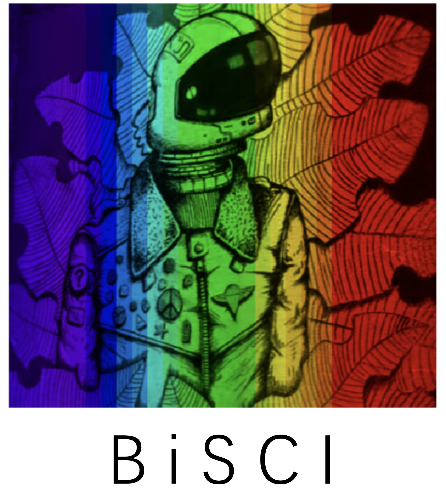

&nbsp;

<div align="center">
<p align="center">  </p>

[](https://arxiv.org/abs/2305.10299)

[](https://paperswithcode.com/sota/spectral-reconstruction-on-kaist?p=degradation-aware-unfolding-half-shuffle)

[](https://paperswithcode.com/sota/spectral-reconstruction-on-real-hsi?p=degradation-aware-unfolding-half-shuffle)


<h2> A Toolbox for Binarized Spectral Compressive Imaging Reconstruction </h2> 


</div>


### News

- **2023.10.24 :** Code, pre-trained models, and results are released. Feel free to check and use them. ⭐
- **2023.09.22 :** Our paper has been accepted by NeurIPS 2023. Code and models will be released. :rocket:


### Results

- This repo is a toolbox containing eight BNN-based methods for spectral compressive imaging

- We provide download links of pre-trained models and results as follows


|     Simulation results     |    Simulation models    |    Real results    |    Real models    |
|  :----------------------:  | :---------------------: | :----------------: | :---------------: |
| &ensp;&ensp; [Google](https://drive.google.com/drive/folders/12Dwh-obfWqtsFDWrJPn6qmOpafa2EYHx?usp=sharing) or [Baidu](https://pan.baidu.com/s/1FZRy9fJg1LqvtqJ3PhBL0Q?pwd=cyh2) &ensp;&ensp; | &ensp;&ensp; [Google](https://drive.google.com/drive/folders/11xMKGyQhUW8bvAxtwUCElUgA4kQFGV8g?usp=sharing) or [Baidu](https://pan.baidu.com/s/1kc1uv9xbw757Njymspv8Wg?pwd=cyh2) &ensp;&ensp; | &ensp;&ensp;&ensp; [Google](https://drive.google.com/drive/folders/1w9nvPfxejzm_I7QnAZabuGrDpqb_C78F?usp=sharing) or [Baidu](https://pan.baidu.com/s/1SqKdHhpH9YWVuOS2tQGlIg?pwd=cyh2) &ensp;&ensp;&ensp; | &ensp;&ensp;&ensp; [Google](https://drive.google.com/drive/folders/1v0py8MjMQju5MWTZMkdmPq_elzUco8uh?usp=sharing) or [Baidu](https://pan.baidu.com/s/1ZaffyEDZ0FcdMdhUj7I5Tw?pwd=cyh2) &ensp;&ensp;&ensp; |


<details close>
<summary><b>Quantitative comparisons on the simulation dataset</b></summary>


</details>

<details close>
<summary><b>Qualitative comparisons on the simulation dataset</b></summary>


</details>

<details close>
<summary><b>Qualitative comparisons on the real dataset</b></summary>


</details>

<details close>
<summary><b>Supported Algorithms:</b></summary>

* [x] [BiConnect](https://proceedings.neurips.cc/paper_files/paper/2015/hash/3e15cc11f979ed25912dff5b0669f2cd-Abstract.html) (NeuIPS 2015)
* [x] [BNN](https://proceedings.neurips.cc/paper_files/paper/2016/hash/d8330f857a17c53d217014ee776bfd50-Abstract.html) (NeuIPS 2016)
* [x] [Bi-Real](https://openaccess.thecvf.com/content_ECCV_2018/html/zechun_liu_Bi-Real_Net_Enhancing_ECCV_2018_paper.html) (ECCV 2018)
* [x] [IRNet](https://openaccess.thecvf.com/content_CVPR_2020/html/Qin_Forward_and_Backward_Information_Retention_for_Accurate_Binary_Neural_Networks_CVPR_2020_paper.html) (CVPR 2020)
* [x] [ReActNet](https://link.springer.com/chapter/10.1007/978-3-030-58568-6_9) (ECCV 2020)
* [x] [BBCU](https://arxiv.org/abs/2210.00405) (ICLR 2023)
* [x] [BTM](https://ojs.aaai.org/index.php/AAAI/article/view/16263) (AAAI 2021)
* [x] [BiSRNet](https://arxiv.org/abs/2305.10299) (NeurIPS 2023)


</details>


&nbsp;


## 1. Create Environment:

- Python 3 (Recommend to use [Anaconda](https://www.anaconda.com/download/#linux))

- [PyTorch >= 1.3](https://pytorch.org/)

- NVIDIA GPU + [CUDA](https://developer.nvidia.com/cuda-downloads)

- Python packages:

```shell
  pip install -r requirements.txt
```

&nbsp;


## 2. Prepare Dataset:

Download cave_1024_28 ([Baidu Disk](https://pan.baidu.com/s/1X_uXxgyO-mslnCTn4ioyNQ), code: `fo0q` | [One Drive](https://bupteducn-my.sharepoint.com/:f:/g/personal/mengziyi_bupt_edu_cn/EmNAsycFKNNNgHfV9Kib4osB7OD4OSu-Gu6Qnyy5PweG0A?e=5NrM6S)), CAVE_512_28 ([Baidu Disk](https://pan.baidu.com/s/1ue26weBAbn61a7hyT9CDkg), code: `ixoe` | [One Drive](https://mailstsinghuaeducn-my.sharepoint.com/:f:/g/personal/lin-j21_mails_tsinghua_edu_cn/EjhS1U_F7I1PjjjtjKNtUF8BJdsqZ6BSMag_grUfzsTABA?e=sOpwm4)), KAIST_CVPR2021 ([Baidu Disk](https://pan.baidu.com/s/1LfPqGe0R_tuQjCXC_fALZA), code: `5mmn` | [One Drive](https://mailstsinghuaeducn-my.sharepoint.com/:f:/g/personal/lin-j21_mails_tsinghua_edu_cn/EkA4B4GU8AdDu0ZkKXdewPwBd64adYGsMPB8PNCuYnpGlA?e=VFb3xP)), TSA_simu_data ([Baidu Disk](https://pan.baidu.com/s/1LI9tMaSprtxT8PiAG1oETA), code: `efu8` | [One Drive](https://1drv.ms/u/s!Au_cHqZBKiu2gYFDwE-7z1fzeWCRDA?e=ofvwrD)), TSA_real_data ([Baidu Disk](https://pan.baidu.com/s/1RoOb1CKsUPFu0r01tRi5Bg), code: `eaqe` | [One Drive](https://1drv.ms/u/s!Au_cHqZBKiu2gYFTpCwLdTi_eSw6ww?e=uiEToT)), and then put them into the corresponding folders of `datasets/` and recollect them as the following form:

```shell
|--MST
    |--real
    	|-- test_code
    	|-- train_code
    |--simulation
    	|-- test_code
    	|-- train_code
    |--visualization
    |--datasets
        |--cave_1024_28
            |--scene1.mat
            |--scene2.mat
            ：  
            |--scene205.mat
        |--CAVE_512_28
            |--scene1.mat
            |--scene2.mat
            ：  
            |--scene30.mat
        |--KAIST_CVPR2021  
            |--1.mat
            |--2.mat
            ： 
            |--30.mat
        |--TSA_simu_data  
            |--mask.mat   
            |--Truth
                |--scene01.mat
                |--scene02.mat
                ： 
                |--scene10.mat
        |--TSA_real_data  
            |--mask.mat   
            |--Measurements
                |--scene1.mat
                |--scene2.mat
                ： 
                |--scene5.mat
```

Following [MST series work](https://github.com/caiyuanhao1998/MST), we use the CAVE dataset (cave_1024_28) as the simulation training set. Both the CAVE (CAVE_512_28) and KAIST (KAIST_CVPR2021) datasets are used as the real training set.


&nbsp;


## 3. Simulation Experiments

### 3.1&ensp;Training

```shell

cd simulation/train_code/

# Binnary Connect
python train.py --outf ./exp/biconnect/ --method biconnect

# BNN
python train.py --outf ./exp/bnn/ --method bnn

# Bi-Real Net
python train.py --outf ./exp/bireal/ --method bireal

# IR-Net
python train.py --outf ./exp/irnet/ --method irnet

# ReActNet
python train.py --outf ./exp/reactnet/ --method reactnet

# BBCU
python train.py --outf ./exp/bbcu/ --method bbcu

# BTM
python train.py --outf ./exp/btm/ --method btm

# BiSRNet
python train.py --outf ./exp/bisrnet/ --method bisrnet

```

- The training logs, trained models, and reconstructed HSIs will be available in `simulation/train_code/exp/`


### 3.2&ensp;Testing

Download the pre-trained weights from ([Google Drive](https://drive.google.com/drive/folders/11xMKGyQhUW8bvAxtwUCElUgA4kQFGV8g?usp=drive_link) / [Baidu Disk](https://pan.baidu.com/s/1kc1uv9xbw757Njymspv8Wg?pwd=cyh2), code: `cyh2`) and place them to `simulation/test_code/model_zoo/`

```shell

cd simulation/test_code/

# Binnary Connect
python test.py --outf ./exp/biconnect/ --method biconnect --pretrained_model_path ./model_zoo/biconnect.pth

# BNN
python test.py --outf ./exp/bnn/ --method bnn --pretrained_model_path ./model_zoo/bnn.pth

# Bi-Real Net
python test.py --outf ./exp/bireal/ --method bireal --pretrained_model_path ./model_zoo/bireal.pth

# IR-Net
python test.py --outf ./exp/irnet/ --method irnet --pretrained_model_path ./model_zoo/irnet.pth

# ReActNet
python test.py --outf ./exp/reactnet/ --method reactnet --pretrained_model_path ./model_zoo/reactnet.pth

# BBCU
python test.py --outf ./exp/bbcu/ --method bbcu --pretrained_model_path ./model_zoo/bbcu.pth

# BTM
python test.py --outf ./exp/btm/ --method btm --pretrained_model_path ./model_zoo/btm.pth

# BiSRNet
python test.py --outf ./exp/bisrnet/ --method bisrnet --pretrained_model_path ./model_zoo/bisrnet.pth

```

- The reconstructed HSIs will be output into `simulation/test_code/exp/`. Then place the reconstructed results into `simulation/test_code/Quality_Metrics/results` and  run the following commend to calculate the PSNR and SSIM of the reconstructed HSIs.

```shell
Run cal_quality_assessment.m
```

- #### Evaluating the Params and FLOPS of models

  We have provided a function `my_summary_bnn()` in `simulation/test_code/utils.py`, please use this function to evaluate the parameters and computational complexity of BNNs.

```shell
from utils import my_summary_bnn
my_summary_bnn(BiSRNet(), 256, 256, 28, 1)
```

### 3.3&ensp;Visualization

- Put the reconstructed HSIs in `visualization/simulation_results/results/` and rename it as `method.mat`, e.g., `bisrnet.mat`

- Generate the RGB images of the reconstructed HSIs:

```shell
 cd visualization/
 run show_simulation.m 
```

- Draw the spectral density lines

```shell
cd visualization/
Run show_line.m
```


&nbsp;


## 4. Real Experiments

### 4.1&ensp;Training

```shell

cd real/train_code/

# Binnary Connect
python train.py --outf ./exp/biconnect/ --method biconnect

# BNN
python train.py --outf ./exp/bnn/ --method bnn

# Bi-Real Net
python train.py --outf ./exp/bireal/ --method bireal

# IR-Net
python train.py --outf ./exp/irnet/ --method irnet

# ReActNet
python train.py --outf ./exp/reactnet/ --method reactnet

# BBCU
python train.py --outf ./exp/bbcu/ --method bbcu

# BTM
python train.py --outf ./exp/btm/ --method btm

# BiSRNet
python train.py --outf ./exp/bisrnet/ --method bisrnet

```

- The training logs, trained models, and reconstructed HSIs will be available in `real/train_code/exp/`


### 4.2&ensp;Testing

Download the pre-trained weights from ([Google Drive](https://drive.google.com/drive/folders/1v0py8MjMQju5MWTZMkdmPq_elzUco8uh?usp=sharing) / [Baidu Disk](https://pan.baidu.com/s/1ZaffyEDZ0FcdMdhUj7I5Tw?pwd=cyh2), code: `cyh2`) and place them to `simulation/test_code/model_zoo/`


```shell

cd real/test_code/

# Binnary Connect
python test.py --method biconnect --pretrained_model_path ./model_zoo/biconnect.pth

# BNN
python test.py --method bnn --pretrained_model_path ./model_zoo/bnn.pth

# Bi-Real Net
python test.py --method bireal --pretrained_model_path ./model_zoo/bireal.pth

# IR-Net
python test.py --method irnet --pretrained_model_path ./model_zoo/irnet.pth

# ReActNet
python test.py --method reactnet --pretrained_model_path ./model_zoo/reactnet.pth

# BBCU
python test.py --method bbcu --pretrained_model_path ./model_zoo/bbcu.pth

# BTM
python test.py --method btm --pretrained_model_path ./model_zoo/btm.pth

# BiSRNet
python test.py --method bisrnet --pretrained_model_path ./model_zoo/bisrnet.pth

```

- The reconstructed HSIs will be output into `real/test_code/results/`  


### 4.3&ensp;Visualization

- Put the reconstructed HSI in `visualization/real_results/results` and rename it as method.mat, e.g., bisrnet.mat.

- Generate the RGB images of the reconstructed HSI

```shell
cd visualization/
Run show_real.m
```

&nbsp;


## 5. Citation

```shell
@inproceedings{bisci,
  title={Binarized Spectral Compressive Imaging},
  author={Yuanhao Cai and Yuxin Zheng and Jing Lin and Haoqian Wang and Xin Yuan and Yulun Zhang},
  booktitle={NeurIPS},
  year={2023}
}
```
